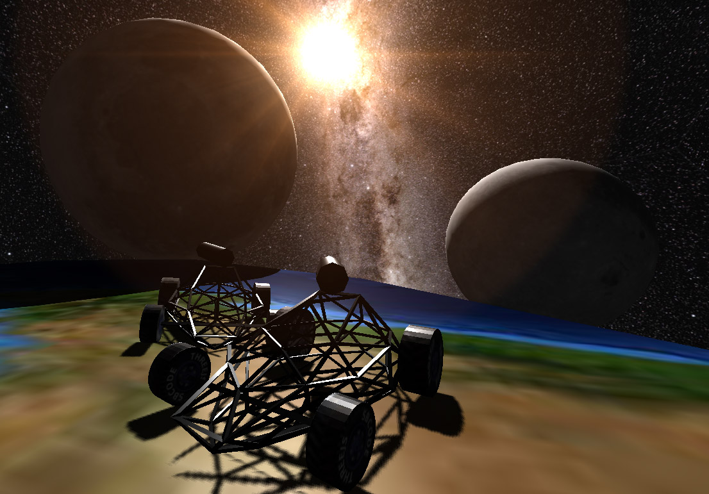

# First Car Shooter

Multiplayer First Car Shooter (FCS) written in Three.js with server side CannonJS physics and SocketIO



## Installing

1. Clone Repository

```bash
git clone https://github.com/Sean-Bradley/First-Car-Shooter.git
```

2. CD into folder

```bash
cd First-Car-Shooter
```

3. Install TypeScript

```bash
npm install -g typescript
```

4. Install dependencies

```bash
npm install
```

5. Start it

```bash
npm run dev
```

6. Visit [http://127.0.0.1:8080](http://127.0.0.1:8080)

* Drive : W, A, S, D
* Brakes : Space
* Aim : Mouse
* Shoot : Mouse Left Click


7. Edit project in VSCode

```bash
code .
```