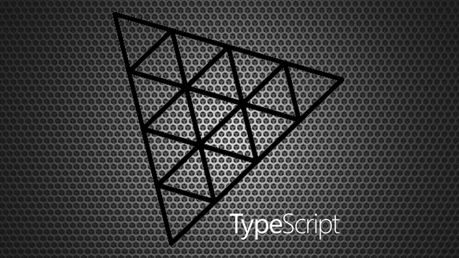

# First Car Shooter (FCS)

Multiplayer FCS written in Three.js, SocketIO and with client and server side CannonJS physics.

Playable Demo : [https://fcs.sbcode.net](https://fcs.sbcode.net)


## About

This is an experiment with,

-   spherical gravity
-   some CannonJS physics calculated server side, everything else calculated client side
-   uses CANNON.Trimesh for ground topography
-   multiplayer using SocketIO
-   sfx with THREE.AudioListener

## Scoring

-   10 points for shooting moons
-   100 points for shooting other players

## Commands

-   Drive: WASD
-   Brakes: SPACE
-   Look: MOUSE
-   Shoot: Left Mouse Click
-   Respawn : R

## Develop

1. Clone Repository

```bash
git clone https://github.com/Sean-Bradley/First-Car-Shooter.git
```

2. CD into folder

```bash
cd First-Car-Shooter
```

3. Install TypeScript

```bash
npm install -g typescript
```

4. Install dependencies

```bash
npm install
```

5. Start it

```bash
npm run dev
```

6. Visit [http://127.0.0.1:8080](http://127.0.0.1:8080)

-   Drive : W, A, S, D
-   Brakes : Space
-   Aim : Mouse
-   Shoot : Mouse Left Click

7. Edit project in VSCode

```bash
code .
```

## Build

1. Build webpack production version.

```
npm run build
```

2. Compile nodejs server script

```
tsc -p ./src/server
```

3. Start

```
npm start
```

4. Visit [http://127.0.0.1:3000](http://127.0.0.1:3000)

Server script uses Express and SocketIO on port 3000

For more in depth information on some deployment options, such as SSL, Domain name & Cloud hosting, visit [https://sbcode.net/threejs/nginx-host/](https://sbcode.net/threejs/nginx-host/)

## Support

To help support my free projects, please take a look at my **ThreeJS and TypeScript** Book


&nbsp;<a href="https://www.amazon.com/dp/B09GYTKRCH">&nbsp; https://www.amazon.com/dp/B09GYTKRCH</a><br/>
&nbsp;<a href="https://www.amazon.co.uk/dp/B09GYTKRCH">&nbsp; https://www.amazon.co.uk/dp/B09GYTKRCH</a><br/>
&nbsp;<a href="https://www.amazon.in/dp/B09GYTKRCH">&nbsp; https://www.amazon.in/dp/B09GYTKRCH</a><br/>
&nbsp;<a href="https://www.amazon.de/dp/B09GYTKRCH">&nbsp; https://www.amazon.de/dp/B09GYTKRCH</a><br/>
&nbsp;<a href="https://www.amazon.fr/dp/B09GYTKRCH">&nbsp; https://www.amazon.fr/dp/B09GYTKRCH</a><br/>
&nbsp;<a href="https://www.amazon.es/dp/B09GYTKRCH">&nbsp; https://www.amazon.es/dp/B09GYTKRCH</a><br/>
&nbsp;<a href="https://www.amazon.it/dp/B09GYTKRCH">&nbsp; https://www.amazon.it/dp/B09GYTKRCH</a><br/>
&nbsp;<a href="https://www.amazon.nl/dp/B09GYTKRCH">&nbsp; https://www.amazon.nl/dp/B09GYTKRCH</a><br/>
&nbsp;<a href="https://www.amazon.co.jp/dp/B09GYTKRCH">&nbsp; https://www.amazon.co.jp/dp/B09GYTKRCH</a><br/>
&nbsp;<a href="https://www.amazon.ca/dp/B09GYTKRCH">&nbsp; https://www.amazon.ca/dp/B09GYTKRCH</a><br/>
&nbsp;<a href="https://www.amazon.com.br/dp/B09GYTKRCH">&nbsp; https://www.amazon.com.br/dp/B09GYTKRCH</a><br/>
&nbsp;<a href="https://www.amazon.com.mx/dp/B09GYTKRCH">&nbsp; https://www.amazon.com.mx/dp/B09GYTKRCH</a><br/>
&nbsp;<a href="https://www.amazon.com.au/dp/B09GYTKRCH">&nbsp; https://www.amazon.com.au/dp/B09GYTKRCH</a>

and my **ThreeJS and TypeScript** courses at [Udemy](https://www.udemy.com/course/threejs-tutorials/?referralCode=4C7E1DE91C3E42F69D0F), [YouTube (Channel membership required)](https://www.youtube.com/playlist?list=PLKWUX7aMnlEKTmkBqwjc-tZgULJdNBjEd) and [Skillshare](https://skl.sh/2uxctEP)

This is only just the beginning of what you will create.

**Course Discount Coupons** : https://sbcode.net/coupons#threejs

[](https://youtu.be/fS4H7gm7gK4)